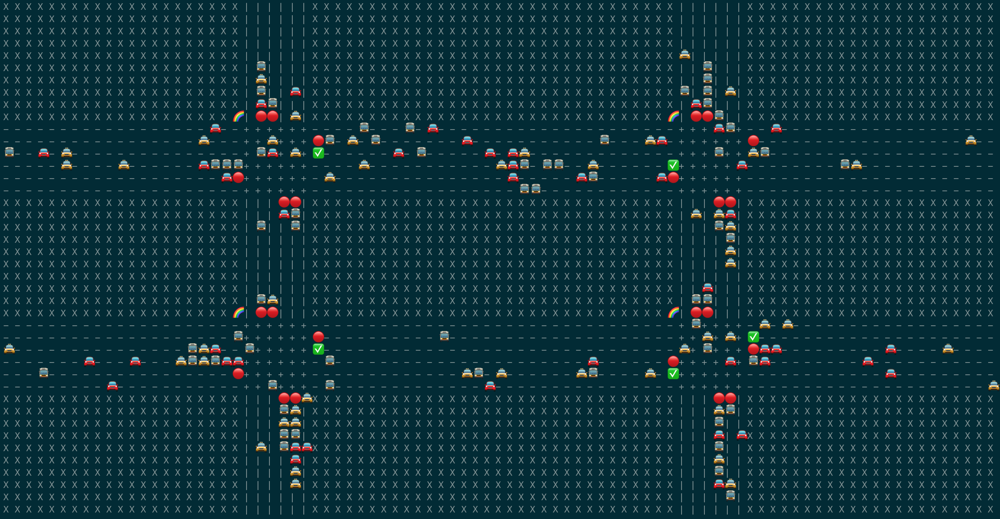

# MarkovForSemaphores

This is s traffic simulation using markov models, where the states are the streets the cars are

`Requires python >3.7`

### Build

pip3 install numpy

### Run and watch your city run

python3 main.py

